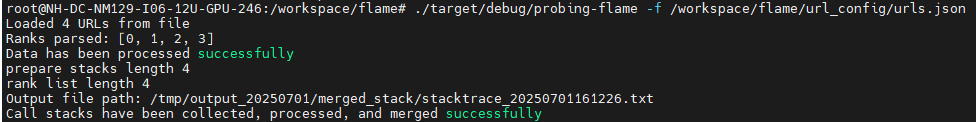
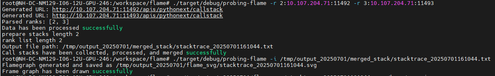
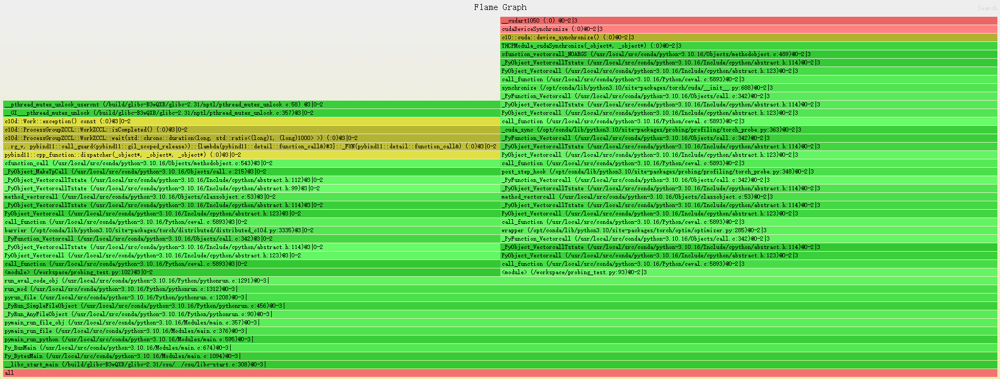

# FLAME介绍

>堆栈合并（Stack Merging）是一种技术，用于将多个调用堆栈中的信息汇总到一起，以便于分析和优化。
>
>火焰图则是一种图形化工具，通过可视化的方式展示函数调用的层次和时间分布，帮助开发者快速定位性能瓶颈。

## 1. 收集数据

**前置条件**: 确保已经启用了性能分析工具Probing网页服务，并且已经生成了性能分析数据.

## 2. 堆栈合并

收集多个rank堆栈信息并进行合并.

## 3. 火焰图绘制

定制化火焰图生成.

## 4. 编译安装

安装好rust工具链后, 执行以下命令:
  
```bash
git https://github.com/moranhhuishou1995/flame
cd flame
cargo build
```

## 5. 使用方式

### 5.1 获取个节点堆栈的txt数据

在url_config文件夹下的urls.json文件中，配置各个节点需要拉取的堆栈信息的url地址

执行以下命令:

```bash
./probing-flame -f ~/flame/url_config/urls.json
```
执行成功后，会在相应文件加生成合并后的堆栈txt文件，也可通过-o参数指定堆栈txt文件的生成目录

```bash
./probing-flame -f ~/flame/url_config/urls.json -o ~/you_want_to_save
```



### 5.2 获取指定节点堆栈的txt数据

无需配置urls.json文件，直接通过-r参数指定需要获取的rank编号的堆栈信息

```bash
./probing-flame -r 2:10.107.204.71:11492 -r 3:10.107.204.71:11493
```


### 5.3 生成火焰图

执行以下命令生成堆栈火焰图, -i参数为合并后的堆栈信息文件，是必须传入的参数:

```bash
./probing-flame -i /home/zj/wangqi/flame/output_20250623/merged_stack/merged_output.txt
```

也可以通过-o参数指定输出的火焰图文件路径:

```bash
./probing-flame -i /home/zj/wangqi/flame/output_20250623/merged_stack/merged_output.txt -o ~/you_want_to_save
```



## 6. Output文件说明

- `urls.json` 为各个节点的url配置文件;
- `merged_output.txt` 为合并后的堆栈信息;
- `merged_output.svg` 为生成的火焰图;
